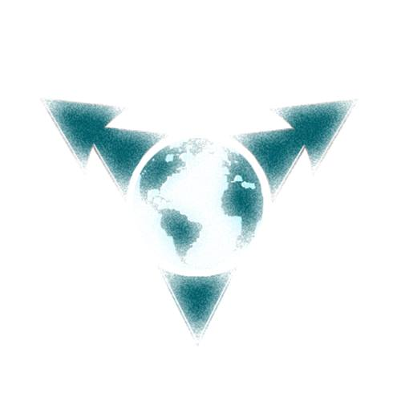

# NestedWorld

### Overview

It's an Android application which want to make you discovering your city by playing.
The goal is to obtain some monsters by visiting some places (we'll use the gps on your phone).

The main goal is to acquire a lot of monster and make them as many strong as they can.

#### Feature :

* explore the arena (defeat your friends).
* conquer zone/dungeon.
* story mode (~offline mode).
* buy booster on the shop.

#### Android spec :
You can play the game if your phone is under JELLY_BEAN (api 16) or any newer version.

#### License
NestedWorld is licensed under the [MIT license.](https://github.com/uberspot/2048-android/blob/master/LICENSE)

